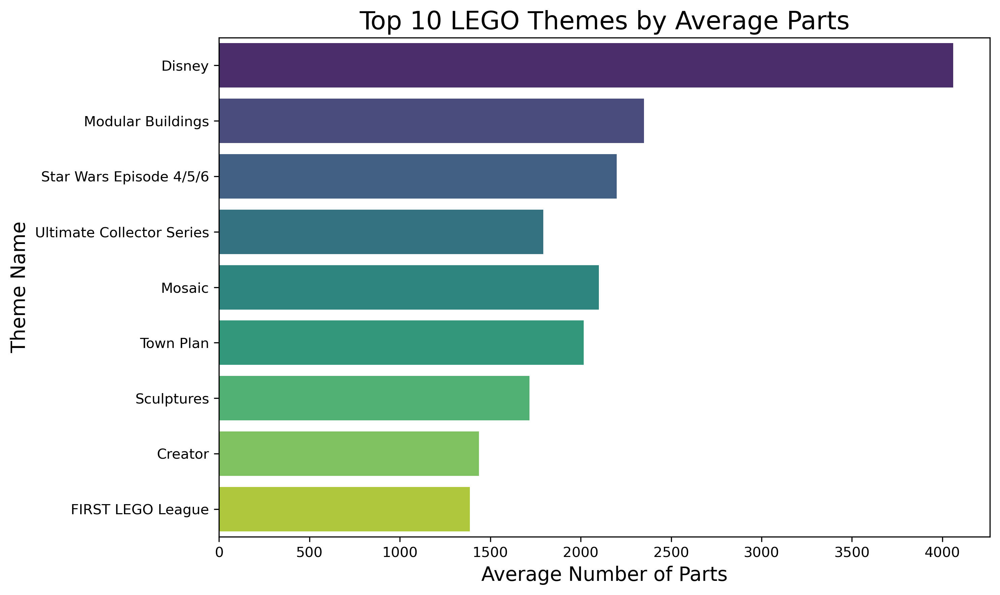
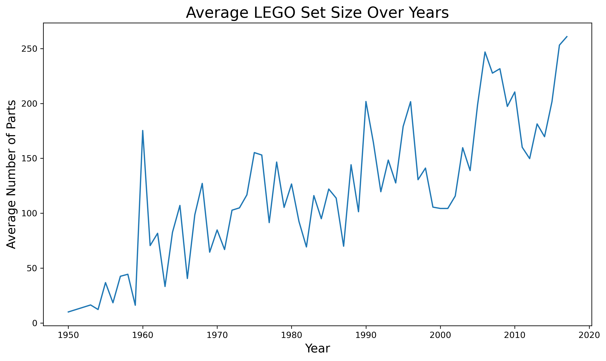

🎯 Goal: Explore LEGO set trends by theme, part count, and release year to understand product complexity, consumer engagement, and lifecycle patterns — key considerations in supply chain planning and merchandising.

Tools: SQL • Python

💡 Key Questions:
- What themes are most complex or popular across time?
- How does set size evolve — and what does that mean for parts inventory?
- Are nostalgic themes more enduring, and how might that affect restocking?

📁 Status: Repo structure in place. Exploratory queries in development. 

## Visuals

### Top LEGO Themes by Set Count

### Average Parts per Theme

### Set Size Trends Over Time

